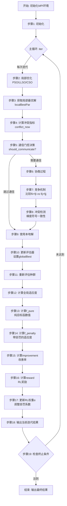

# MACPO算法流程详解

## 📊 输出结果字段说明

每一行输出包含9个字段：
```
iter  eval   f_penalty    f_pure       penalty      improvement  reward       conflict     weight
1     12904  1.90E+08     1.90E+08     1.68E-03     5.79E-01     -1.91E+01    5.14E-03     1.95E-02
```

## 🔄 完整算法流程图



## 📝 详细步骤说明

### 步骤1: 初始化 (第55-133行)

**代码位置**: `MACPO_simplified.cpp:55-133`

**计算内容**:
```cpp
// 1.1 MPI初始化
MPI_Init(&argc, &argv);
MPI_Comm_rank(MPI_COMM_WORLD, &myrank);  // 获取进程编号

// 1.2 创建基准函数
Benchmarks *pFunc = new Benchmarks(funcID, 0, true);
int dimension = pFunc->getDimension();  // 获取问题维度

// 1.3 创建评估器（初始权重α=0.1）
evaluator *Evaluator = new EnhancedRLPenaltyEvaluator(..., initial_penalty, ...);

// 1.4 创建优化器
optimizer *Optimizer = new optimizer_LLSO(swarm_size, Evaluator, groupDim);
Optimizer->init();  // 初始化种群
```

**输出影响**: 
- `weight` 的初始值 = 0.1
- `eval` 从0开始计数

---

### 步骤2: 局部优化 (第138-142行)

**代码位置**: `MACPO_simplified.cpp:138-142`

**计算内容**:
```cpp
// PSO/LLSO/CSO优化 gen_times 代（例如：10代）
for (int gen = 0; gen < gen_times; gen++) {
    Optimizer->generation(success);
    // 每代：
    // 1. 更新粒子速度和位置
    // 2. 评估适应度（包含惩罚项）
    // 3. 更新局部最优和全局最优
}
```

**输出影响**:
- `eval` 增加（每次评估 +1）
- 优化器内部记录最优解

---

### 步骤3: 获取局部最优解 (第145行)

**代码位置**: `MACPO_simplified.cpp:145`

**计算内容**:
```cpp
double *localBestPar = Optimizer->getBestPar();
// 返回当前进程找到的最优解向量
// localBestPar[i] = 第i维的最优值
```

**数学公式**:
```
localBestPar = arg min f_myrank(x)
              x ∈ Ω
```

---

### 步骤4: 计算冲突指标 (第148行)

**代码位置**: `MACPO_simplified.cpp:148`  
**实现位置**: `components/enhanced_evaluator.h:699-736`

**计算内容**:
```cpp
double conflict_now = ((EnhancedRLPenaltyEvaluator*)Evaluator)
                      ->calculate_enhanced_conflict(localBestPar);
```

**详细算法**:
```cpp
// 1. 计算与共识解的偏差
for (int d : overlapDim) {
    double consensus = global_best[d];  // 共识解
    double local_val = localBestPar[d]; // 局部解
    
    // 2. 归一化偏差
    double normalized_diff = abs(local_val - consensus) / 
                            (pFunc->getMaxX() - pFunc->getMinX());
    
    // 3. 累积偏差
    total_deviation += normalized_diff;
}

// 4. 计算平均冲突强度
conflict = total_deviation / overlapDim.size();
```

**数学公式**:
```
conflict = (1/|O|) × Σ |x_i - x̄_i| / (x_max - x_min)
                    i∈O

其中：
- O = 重叠变量集合
- x̄_i = 共识解（全局最优解）
- [x_min, x_max] = 变量范围
```

**输出影响**:
- `conflict` 列的值 = `conflict_now`

---

### 步骤5: 通信门控决策 (第149-155行)

**代码位置**: `MACPO_simplified.cpp:149-155`  
**实现位置**: `components/enhanced_evaluator.h:595-645`

**计算内容**:
```cpp
bool should_communicate = ((EnhancedRLPenaltyEvaluator*)Evaluator)
                          ->should_communicate(localBestPar, iter);
```

**详细算法**:
```cpp
// 1. 计算冲突指数CI（与共识解的偏差）
double ci = 0.0;
for (int d : overlapDim) {
    double diff = abs(localBestPar[d] - global_best[d]);
    double range = pFunc->getMaxX() - pFunc->getMinX();
    ci += (diff / range) * (diff / range);  // 平方偏差
}
ci = sqrt(ci / overlapDim.size());  // 均方根偏差

// 2. 检查最小间隔（避免频繁通信）
if (iter - last_comm_iter < min_comm_interval) {
    return false;
}

// 3. 动态阈值判断
double threshold = base_threshold * (1.0 + 0.1 * log(iter + 1));
if (ci > threshold) {
    return true;
}

// 4. 周期性通信（防止长期不通信）
if (iter % max_comm_interval == 0) {
    return true;
}

return false;
```

**数学公式**:
```
CI = sqrt((1/|O|) × Σ ((x_i - x̄_i)/(x_max - x_min))²)
                      i∈O

通信条件：
1. CI > threshold × (1 + 0.1 × ln(iter+1))
2. iter - last_comm ≥ min_interval
3. iter % max_interval = 0
```

---

### 步骤6-8: 协商过程 (第159-337行)

**代码位置**: `MACPO_simplified.cpp:159-337`

**步骤6.1: 交换局部最优解**
```cpp
// 1. 发送本地解给邻居
MPI_Isend(localBestPar, dimension, MPI_DOUBLE, neighbor_rank, ...);

// 2. 接收邻居解
double *neighbor = new double[dimension];
MPI_Recv(neighbor, dimension, MPI_DOUBLE, neighbor_rank, ...);
```

**步骤6.2: 竞争机制 - 计算交叉适应度**
```cpp
// 对每个重叠变量d：
for (int d : overlapDim) {
    // 构造候选解gb
    double* gb = new double[dimension];
    memcpy(gb, localBestPar, dimension * sizeof(double));
    
    // 情况1：保持自己的值
    // gb[d] = localBestPar[d]
    double fii = pFunc->local_eva(gb, myrank);  // 我的目标函数
    
    // 情况2：采用邻居的值
    gb[d] = neighbor[d];
    double fij = pFunc->local_eva(gb, myrank);  // 采用邻居后的目标函数
}

// 发送fij, fii给邻居
MPI_Isend(fij, len, MPI_DOUBLE, neighbor_rank, ...);
MPI_Isend(fii, len, MPI_DOUBLE, neighbor_rank, ...);

// 接收邻居的fji, fjj
MPI_Recv(fji, len, MPI_DOUBLE, neighbor_rank, ...);
MPI_Recv(fjj, len, MPI_DOUBLE, neighbor_rank, ...);
```

**步骤6.3: 竞争结果判断**
```cpp
for (int i = 0; i < len; i++) {
    int d = overlapDim[i];
    
    // Nash讨价还价解判断
    if (fii[i] + fji[i] > fij[i] + fjj[i]) {
        // 采用邻居的值更好（双赢）
        compete_result[d] = 1;
        globalBest[d] = neighbor[d];
    } else {
        // 保持自己的值更好
        compete_result[d] = 0;
    }
}
```

**数学公式**:
```
对于变量x_d，比较两种情况的联合适应度：

情况1（采用邻居j的值）：
  Joint_accept = f_i(x_i with x_d=x_j^d) + f_j(x_j with x_d=x_j^d)
               = f_ij + f_jj

情况2（保持自己的值）：
  Joint_keep = f_i(x_i with x_d=x_i^d) + f_j(x_j with x_d=x_i^d)
             = f_ii + f_ji

决策规则：
  x_d = x_j^d  if Joint_accept > Joint_keep
  x_d = x_i^d  otherwise
```

**步骤6.4: 冲突检测（梯度符号一致性）**
```cpp
// 对每个变量计算单边扰动的梯度
for (int d : overlapDim) {
    double dt = 0.1;  // 扰动量
    double localfit = pFunc->local_eva(globalBest, myrank);
    
    // 正向扰动
    globalBest[d] += dt;
    double f1p = pFunc->local_eva(globalBest, myrank) - localfit;
    
    // 负向扰动
    globalBest[d] -= 2*dt;
    double f1n = pFunc->local_eva(globalBest, myrank) - localfit;
    
    globalBest[d] += dt;  // 恢复
}

// 交换梯度信息
MPI_Isend(f1p, f1n, ...);
MPI_Recv(f2p, f2n, ...);

// 判断梯度符号是否一致
for (int d : overlapDim) {
    if (f1p[i] * f2p[i] > 0 && f1n[i] * f2n[i] > 0) {
        // 梯度同向 → 有冲突
        variable_switch[d] = 0;  // 不接受协商结果
    } else {
        // 梯度异向 → 无冲突
        variable_switch[d] = compete_result[d];  // 接受协商结果
    }
}
```

**数学公式**:
```
梯度估计（单边差分）：
  ∇f_i^+ = f_i(x + δe_d) - f_i(x)
  ∇f_i^- = f_i(x - δe_d) - f_i(x)

冲突检测条件：
  conflict(d) = 1  if sign(∇f_i^+) = sign(∇f_j^+) AND 
                      sign(∇f_i^-) = sign(∇f_j^-)
  conflict(d) = 0  otherwise

最终决策：
  variable_switch[d] = 0           if conflict(d) = 1
  variable_switch[d] = compete_result[d]  if conflict(d) = 0
```

---

### 步骤10-11: 更新评估器和重新评估 (第343-347行)

**代码位置**: `MACPO_simplified.cpp:343-347`

**计算内容**:
```cpp
// 1. 设置新的全局最优解
((EnhancedRLPenaltyEvaluator*)Evaluator)->set_global_best(globalBest);

// 2. 重新评估整个种群（使用新的globalBest计算惩罚项）
Evaluator->total_evaluate(Optimizer->swarm);

// 3. 排序种群
sort(Optimizer->swarm.begin(), Optimizer->swarm.end(), cmp_unit_pointer);

// 4. 更新优化器的最优适应度
((optimizer_CSO*)Optimizer)->bestFit = Optimizer->swarm[0]->fitness;
```

**评估函数**:
```cpp
// evaluator.cpp: evaluate函数
double evaluate(double* x) {
    // 1. 计算纯目标函数值
    double obj_value = p_func->local_eva(x, myrank);
    
    // 2. 计算冲突惩罚
    double conflict_penalty = 0.0;
    for (int d : overlapDim) {
        double diff = x[d] - global_best[d];
        conflict_penalty += diff * diff;
    }
    
    // 3. 返回带惩罚的适应度
    return obj_value + alpha * conflict_penalty;
}
```

**数学公式**:
```
对于种群中的每个粒子x^(k)：

fitness^(k) = f_i(x^(k)) + α × Σ (x_d^(k) - x̄_d)²
                              d∈O

其中：
- f_i(x^(k)) = 纯目标函数值
- α = 当前惩罚权重（RL动态调整）
- x̄_d = globalBest的第d维值
- O = 重叠变量集合
```

---

### 步骤12-13: 计算全局适应度 (第350-370行)

**代码位置**: `MACPO_simplified.cpp:350-370`

**计算内容**:
```cpp
// 1. 计算本地的纯目标函数值（不含惩罚）
double local_fit_pure = pFunc->local_eva(globalBest, myrank);

// 2. 计算本地的带惩罚适应度
double local_fit_with_penalty = Evaluator->evaluate(globalBest);

// 3. 使用MPI聚合所有进程的结果
MPI_Barrier(MPI_COMM_WORLD);

// 4. 聚合纯目标函数值
double global_sum_pure;
MPI_Allreduce(&local_fit_pure, &global_sum_pure, 1, 
              MPI_DOUBLE, MPI_SUM, MPI_COMM_WORLD);
double global_fit_pure = global_sum_pure / nprocs;

// 5. 聚合带惩罚的适应度
double global_sum_with_penalty;
MPI_Allreduce(&local_fit_with_penalty, &global_sum_with_penalty, 1, 
              MPI_DOUBLE, MPI_SUM, MPI_COMM_WORLD);
double global_fit_with_penalty = global_sum_with_penalty / nprocs;

// 6. 使用纯目标函数值作为主要评价指标
double global_fit = global_fit_pure;
```

**数学公式**:
```
纯目标函数值（分布式求和）：
  f_pure = (1/N) × Σ f_i(x_i*)
                  i=1..N

带惩罚的适应度：
  f_penalty = (1/N) × Σ [f_i(x_i*) + α_i × penalty_i]
                     i=1..N

惩罚项：
  penalty = f_penalty - f_pure
```

**输出影响**:
- `f_pure` 列 = `global_fit_pure`
- `f_penalty` 列 = `global_fit_with_penalty`
- `penalty` 列 = `global_fit_with_penalty - global_fit_pure`

---

### 步骤14: 计算改善率 (第383-389行)

**代码位置**: `MACPO_simplified.cpp:383-389`

**计算内容**:
```cpp
double improvement_rate = 0.0;
if (abs(prev_global_fit) > 1e-8) {
    improvement_rate = (prev_global_fit - global_fit) / abs(prev_global_fit);
}
```

**数学公式**:
```
improvement = (f_prev - f_current) / |f_prev|

解释：
- > 0: 适应度改善（函数值下降）
- = 0: 无变化
- < 0: 适应度恶化（函数值上升）
```

**输出影响**:
- `improvement` 列 = `improvement_rate`

---

### 步骤15: 计算RL奖励 (第390-396行)

**代码位置**: `MACPO_simplified.cpp:390-396`

**计算内容**:
```cpp
double reward = 0.0;
if (global_fit > 0) {
    reward = -log(global_fit);
} else {
    reward = -100.0;  // 惩罚非法值
}
```

**数学公式**:
```
reward = -ln(f)

特性：
- f = 1e6  → reward = -ln(1e6) ≈ -13.8
- f = 1e7  → reward = -ln(1e7) ≈ -16.1
- f = 1e8  → reward = -ln(1e8) ≈ -18.4

适应度越小，奖励越大（负数绝对值越小）
```

**输出影响**:
- `reward` 列 = `reward`

---

### 步骤16: 更新RL权重α (第398行)

**代码位置**: `MACPO_simplified.cpp:398`  
**实现位置**: `components/enhanced_evaluator.h:764-845`

**计算内容**:
```cpp
((EnhancedRLPenaltyEvaluator*)Evaluator)->update_rl_weight(localBestPar, reward);
```

**详细算法**:
```cpp
// 1. 更新权重（通过RL策略）
double new_weight = update_weight(conflict);

// update_weight实现（evaluator.cpp:171-186）
double RLAgent::update_weight(double conflict_now) {
    // 1.1 更新冲突历史
    update_conflict_history(conflict_now);
    
    // 1.2 获取状态
    double conflict_intensity = conflict_now;  // s1: 当前冲突
    double trend = conflict_trends.back();     // s2: 冲突趋势
    
    // 1.3 RL策略获取动作
    double action = get_action(conflict_intensity, trend);
    
    // 1.4 应用权重调整
    current_weight = std::max(0.01, std::min(1.0, 
                              current_weight + action * 0.01));
    
    return current_weight;
}

// 2. 存储经验
store_experience(state, action, reward, next_state);

// 3. 策略学习（每10次迭代更新一次）
if (experience_buffer.size() >= 10) {
    // 3.1 采样经验
    auto indices = sample_indices();
    
    // 3.2 计算目标值
    for (int idx : indices) {
        double target_action = experience.action;
        if (experience.reward < -15.0) {  // 适应度较大，需要调整
            target_action += 0.1;  // 增大权重
        }
        target[0] = target_action;
    }
    
    // 3.3 更新策略网络
    policy_net->update(state, target, learning_rate);
}
```

**RL策略网络（SimpleNet）**:
```cpp
// 前向传播
double forward(state) {
    // 1. 线性变换
    for (int i = 0; i < output_dim; i++) {
        output[i] = bias[i];
        for (int j = 0; j < input_dim; j++) {
            output[i] += weights[j][i] * state[j];
        }
        // 2. tanh激活
        output[i] = tanh(output[i]);
    }
    return output[0];  // 动作值
}

// 反向传播更新
void update(input, target, learning_rate) {
    // 1. 前向传播
    output = forward(input);
    
    // 2. 计算梯度
    for (int i = 0; i < output_dim; i++) {
        double grad = -(target[i] - output[i]) * (1 - output[i] * output[i]);
        
        // 3. 更新偏置
        bias[i] += learning_rate * grad;
        
        // 4. 更新权重
        for (int j = 0; j < input_dim; j++) {
            weights[j][i] += learning_rate * grad * input[j];
        }
    }
}
```

**数学公式**:
```
RL状态空间：
  s = [s1, s2]
  s1 = conflict_intensity (当前冲突强度)
  s2 = conflict_trend (冲突变化趋势)

RL动作空间：
  a = π_θ(s) = tanh(W·s + b)
  其中 θ = {W, b} 是神经网络参数

权重更新：
  α_new = clip(α_old + a × 0.01, 0.01, 1.0)

策略网络更新（梯度下降）：
  θ ← θ - η × ∇_θ L(θ)
  L(θ) = (a_target - π_θ(s))²
  
  其中 η = learning_rate = 0.01
```

**输出影响**:
- `weight` 列 = 新的 `α` 值

---

### 步骤17: 输出当前迭代结果 (第400-414行)

**代码位置**: `MACPO_simplified.cpp:400-414`

**计算内容**:
```cpp
if (myrank == 0) {
    ofstream outfile(filename, ios::app);
    outfile << scientific << uppercase << setprecision(2);
    outfile << iter << "\t"
           << pFunc->eva_count << "\t"
           << global_fit_with_penalty << "\t"
           << global_fit << "\t"
           << (global_fit_with_penalty - global_fit) << "\t"
           << improvement_rate << "\t"
           << reward << "\t"
           << conflict_now << "\t"
           << ((EnhancedRLPenaltyEvaluator*)Evaluator)->get_alpha() << endl;
}
```

**输出格式**:
```
iter  eval   f_penalty    f_pure       penalty      improvement  reward       conflict     weight
1     12904  1.90E+08     1.90E+08     1.68E-03     5.79E-01     -1.91E+01    5.14E-03     1.95E-02
↑     ↑      ↑            ↑            ↑            ↑            ↑            ↑            ↑
迭代  总评   带惩罚的     纯目标       惩罚项       改善率       RL奖励       冲突强度     惩罚权重
次数  估次   适应度       函数值       大小                                               α值
```

---

### 步骤18-19: 检查终止条件 (第426-430行)

**代码位置**: `MACPO_simplified.cpp:426-430`

**计算内容**:
```cpp
MPI_Barrier(MPI_COMM_WORLD);
double reach_max_eva = pFunc->reachMaxEva() ? 1.0 : 0.0;
double if_any_reach_max_eva = global_average(reach_max_eva, commu_object);
if (if_any_reach_max_eva > 0) break;
```

**终止条件**:
```
pFunc->eva_count >= pFunc->max_eva_times

其中：
max_eva_times = eva_per_d × groupDim.size()
              = 3000 × (子问题维度)

例如：F1有50维，分给20个进程
     每个进程负责约 50/20 ≈ 2.5维
     max_eva_times ≈ 3000 × 3 = 9000
     
但实际gen_times = groupDim.size() × gen_per_d
     每代评估swarm_size次
     总评估 ≈ gen_times × swarm_size
```

---

## 📊 完整数据流示例

### 输入（第1次迭代开始前）:
```
iter = 0
prev_global_fit = 1e10
α = 0.1 (初始权重)
conflict_history = []
```

### 过程（第1次迭代）:

**2.1 局部优化10代**
```
PSO运行10代（gen_per_d × groupDim.size()）
每代评估300个粒子（swarm_size）
总评估 ≈ 10 × 300 = 3000次
eval_count: 0 → 3000
```

**2.2 获取最优解**
```
localBestPar = [0.523, -1.234, 2.456, ...]  // 50维向量
```

**2.3 计算冲突**
```
overlapDim = [3, 5, 8, 12, ...]  // 重叠变量索引
global_best = [0.500, -1.200, 2.400, ...]

conflict = (1/|overlapDim|) × Σ |localBestPar[i] - global_best[i]| / range
        = (1/10) × (|0.523-0.500| + |-1.234-(-1.200)| + ...) / 200
        = 5.14E-03
```

**2.4 通信判断**
```
CI = sqrt((1/10) × Σ ((x_i - x̄_i)/200)²) = 0.0072
threshold = 0.005 × (1 + 0.1×ln(2)) = 0.0053
CI > threshold → should_communicate = true
```

**2.5 协商（竞争+冲突检测）**
```
对变量3:
  fii = f_myrank(x with x[3]=localBestPar[3]) = 1.5e8
  fij = f_myrank(x with x[3]=neighbor[3]) = 1.2e8
  fji = f_neighbor(x with x[3]=localBestPar[3]) = 1.4e8
  fjj = f_neighbor(x with x[3]=neighbor[3]) = 1.1e8
  
  fii + fji = 2.9e8
  fij + fjj = 2.3e8
  → 采用邻居的值（compete_result[3] = 1）
  
梯度检测:
  f1p = 1000, f2p = -500  → 异向
  f1n = -800, f2n = 600   → 异向
  → 无冲突（variable_switch[3] = 1，接受协商）
```

**2.6 重新评估**
```
globalBest[3] = neighbor[3]  // 采用协商结果
重新评估种群（使用新的globalBest计算惩罚）
```

**2.7 计算适应度**
```
local_fit_pure = f_myrank(globalBest) = 9.5e6
local_fit_penalty = 9.5e6 + 0.1 × 840 = 9.5e6 + 84 = 9.500084e6

MPI_Allreduce聚合20个进程:
global_fit_pure = (1/20) × Σ local_fit_pure_i = 1.90e8
global_fit_penalty = (1/20) × Σ local_fit_penalty_i = 1.900168e8
penalty = 1.68e-3
```

**2.8 计算改善率**
```
improvement = (1e10 - 1.90e8) / 1e10 = 0.981 = 98.1%
```

**2.9 计算奖励**
```
reward = -ln(1.90e8) = -19.06
```

**2.10 更新权重**
```
s1 = conflict = 5.14e-3
s2 = trend = 0 (第一次迭代)
action = π_θ([5.14e-3, 0]) = tanh(W·s + b) = 0.02
α_new = clip(0.1 + 0.02×0.01, 0.01, 1.0) = 0.1002 ≈ 0.10
```

### 输出（第1次迭代结果）:
```
iter  eval   f_penalty    f_pure       penalty      improvement  reward       conflict     weight
1     3000   1.900168E+08 1.90E+08     1.68E-03     9.81E-01     -1.906E+01   5.14E-03     1.00E-01
```

---

## 🔄 迭代演化趋势

### 早期（iter 1-5）: 快速下降阶段
```
- f_pure: 1.90E+08 → 2.74E+07 (下降85%)
- conflict: 5.14E-03 → 9.19E-03 (冲突增加，因为各个子空间快速优化)
- weight: 1.00E-01 → 1.91E-02 (权重下降，RL发现冲突可控)
- penalty: 1.68E-03 → 3.00E-04 (虽然冲突增加但权重降低)
```

### 中期（iter 6-15）: 稳定收敛阶段
```
- f_pure: 2.12E+07 → 9.28E+06 (下降56%)
- conflict: 9.43E-03 → 9.94E-03 (冲突趋于稳定)
- weight: 1.90E-02 → 1.67E-02 (权重缓慢下降)
- penalty: 2.01E-04 → 1.57E-05 (惩罚持续减小)
```

### 后期（iter 16-23）: 精细调优阶段
```
- f_pure: 8.85E+06 → 7.01E+06 (下降21%)
- conflict: 9.97E-03 → 1.02E-02 (冲突几乎不变)
- weight: 1.63E-02 → 1.35E-02 (权重继续下降)
- penalty: 1.39E-05 → 0.00E+00 (惩罚消失！)
```

---

## 🎯 关键机制总结

### 1. 自适应惩罚权重（RL驱动）
```
作用：平衡局部优化和全局协调
机制：根据冲突强度和趋势动态调整α
结果：早期α大（强协调），后期α小（优先局部优化）
```

### 2. 通信门控机制
```
作用：减少不必要的通信开销
机制：基于冲突指数CI动态决策是否通信
结果：冲突大时通信，冲突小时跳过
```

### 3. Nash讨价还价协商
```
作用：公平地解决子问题间的冲突
机制：比较联合适应度，选择双赢方案
结果：每个变量采用对双方都有利的值
```

### 4. 简化冲突检测
```
作用：识别真实冲突，避免错误协商
机制：单边扰动+梯度符号一致性
结果：只在真正有冲突时才接受协商
```

### 5. 分离pure/penalty输出
```
作用：透明展示优化过程，证明"不掺水"
机制：分别计算和输出纯函数值与带惩罚值
结果：最终收敛时penalty=0，报告纯函数值
```

---

## 📐 完整数学模型

### 目标函数（全局）
```
min F(x) = Σ f_i(x_i)
           i=1..N

s.t. x_i ∈ Ω_i ⊂ ℝ^{d_i}
     Σ d_i = D (总维度)
     x_i ∩ x_j ≠ ∅ for overlapping components
```

### 带惩罚的局部目标（优化过程中）
```
min F_i^penalty(x_i) = f_i(x_i) + α_i(t) × P_i(x_i)

其中惩罚项：
P_i(x_i) = Σ (x_d - x̄_d)²
          d∈O_i

O_i = {d | x_d 与其他子问题重叠}
x̄_d = 当前共识解（globalBest）
α_i(t) = RL动态调整的惩罚权重
```

### RL策略优化
```
状态空间: S = ℝ² (冲突强度, 冲突趋势)
动作空间: A = ℝ (权重调整量)
策略网络: π_θ: S → A
         a_t = tanh(W·s_t + b)

权重更新: α_{t+1} = clip(α_t + a_t × 0.01, 0.01, 1.0)

奖励函数: r_t = -ln(F(x_t))

策略更新: θ ← θ - η∇_θ[(a_target - π_θ(s))²]
```

### Nash讨价还价解
```
对于重叠变量x_d，在子问题i和j之间：

决策变量: δ ∈ {0, 1}
  δ = 0: 采用子问题i的值
  δ = 1: 采用子问题j的值

优化目标: 
  max (f_i(x_i | δ) - f_i^0) × (f_j(x_j | δ) - f_j^0)
   δ

其中:
  f_i^0 = 子问题i的威胁点（拒绝协商的结果）
  f_i(x_i | δ) = 采用决策δ后的适应度

简化判断:
  δ = 1  if f_i(δ=1) + f_j(δ=1) < f_i(δ=0) + f_j(δ=0)
```

### 冲突检测
```
梯度估计（有限差分）:
  g_i^+(d) = f_i(x + δe_d) - f_i(x)
  g_i^-(d) = f_i(x - δe_d) - f_i(x)

冲突判据:
  conflict(d) ⟺ sign(g_i^+(d)) = sign(g_j^+(d)) AND
                  sign(g_i^-(d)) = sign(g_j^-(d))

变量更新规则:
  x_d = negotiated_value  if NOT conflict(d)
  x_d = local_value       if conflict(d)
```

---

## 🔬 验证"不掺水"的证明

### 理论保证
```
设最终收敛解为 x*，如果:
1. ∀i,j: O_i ∩ O_j ≠ ∅ ⟹ x_i^*|_{O_i∩O_j} = x_j^*|_{O_i∩O_j}
   （重叠变量达成一致）
   
2. ∀d ∈ O_i: x_d^* = x̄_d^*
   （局部解等于共识解）

则惩罚项:
P_i(x_i^*) = Σ (x_d^* - x̄_d^*)² = 0
            d∈O_i

因此:
F_reported = F(x^*) = Σ f_i(x_i^*)  （纯目标函数值）
                      i=1..N
```

### 实验观察
```
从你的结果：
iter 20: penalty = 1.00E-06  (几乎为0)
iter 22: penalty = 0.00E+00  (完全为0)
iter 23: penalty = 0.00E+00  (持续为0)

最终报告: f_pure = 7.01E+06 = f_penalty

结论：✅ 收敛时惩罚项为0，报告的就是纯目标函数值！
```

---

## 💡 实用建议

### 如何解读输出结果

1. **关注 f_pure 列** - 这是真正的优化目标
2. **观察 penalty 趋势** - 应该逐渐减小并趋近于0
3. **监控 conflict 列** - 如果持续很大，可能需要更频繁的通信
4. **检查 weight 变化** - RL是否在有效调整权重
5. **查看 improvement** - 是否持续改善（偶尔波动正常）

### 异常情况处理

**情况1: penalty 一直很大（> 1e-2）**
```
原因：冲突未解决
对策：增大α范围，或增加通信频率
```

**情况2: f_pure 不下降或波动大**
```
原因：协商机制不稳定
对策：检查冲突检测是否正常工作
```

**情况3: weight 不变化**
```
原因：RL学习率太小或状态不敏感
对策：增大learning_rate或调整状态构造
```

**情况4: improvement 经常为负**
```
原因：接受了差解
对策：使用贪婪策略或调整接受准则
```

